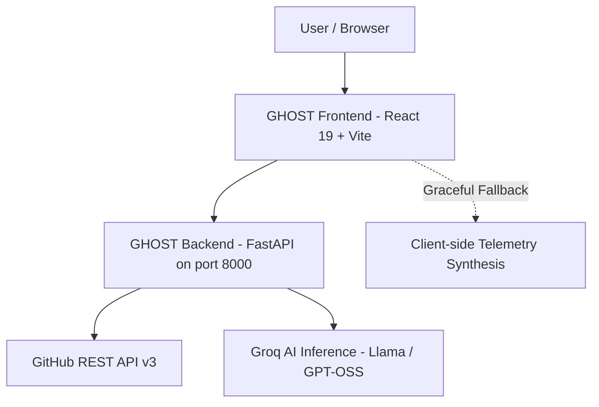

# 👻 GHOST — GitHub has officially seen truth

[](https://react.dev/)
[](https://vitejs.dev/)
[](https://tailwindcss.com/)
[](https://fastapi.tiangolo.com/)
[](https://groq.com/)
[](https://www.python.org/)
[](./LICENSE)

> **GHOST** (*GitHub has officially seen truth*) is an engineering telemetry and developer intelligence engine. Rather than relying on surface-level vanity metrics, GHOST looks at code velocity, language distribution, upstream open-source contributions, and LLM-synthesized career intelligence for any developer on GitHub.

---

## 🌟 Key Features

### 🌌 Interactive Visual Experience
- **Cosmic Parallax Starfield & Horizon**: 3-layer GPU-accelerated parallax star drift with atmospheric glow and curved orbital horizon, creating an authentic cinematic aesthetic without heavy canvas overhead.
- **Variable Font Physics**: Hero header dynamically adjusts letter weights in real-time as your cursor moves across the viewport.
- **Glassmorphism Dark Theme**: Dark aesthetic (`#080811`) with micro-animations and responsive layout.

### 🧠 AI Executive Summary & Career Intelligence
- **AI Executive Summary**: Synthesis of developer strengths, language distributions, and commit patterns powered by Groq.
- **Role Alignment**: High-confidence detection of the developer's best-suited role (e.g., *Systems Architect, Full-Stack Engineer, Core Maintainer*).
- **Skill Gaps & Strategic Recommendations**: Actionable growth points to expand technical breadth and observability.
- **Projects to Build Next**: High-leverage concept projects tailored to close specific skill gaps.
- **Profile & README Enhancements**: Prescriptive ideas to maximize the impact of flagship repositories.
- **Resume & LinkedIn Achievements**: Quantified, impact-driven bullet points synthesized directly from repository metrics, complete with 1-click clipboard copy.

### 🌍 Open-Source Ecosystem Impact
- **Upstream Contribution Tracking**: Filters out self-owned repositories to highlight PRs merged into external organizations and community codebases.
- **Ecosystem KPIs**: PRs merged, issues opened, code reviews, and community rank tiering.
- **Good First Issue Recommendations**: Discovers high-affinity repositories in the developer's primary languages that currently have open `good first issue` labels.

### 📊 Deep Developer Telemetry & Dashboard
- **Language Telemetry**: Aggregate breakdown of technologies and languages across the developer's public repositories.
- **Flagship & Widely-Forked Highlights**: Cards displaying the user's most starred and most forked projects.
- **Client-Side Filter & Sort**: Search repositories by keyword, filter by technology, or sort by update recency, stars, and age.
- **Followers & Following Inspector**: Modal exploring social connections with live GitHub statistics.

---

## 🏗️ Architecture & Tech Stack



| Layer | Technologies |
| :--- | :--- |
| **Frontend** | React 19, Vite, Tailwind CSS, Lucide React, OGL (WebGL), Motion |
| **Backend** | Python 3.10+, FastAPI, Uvicorn, httpx (async HTTP), Pydantic v2 |
| **AI / LLM** | Groq SDK, Structured JSON schema outputs (`openai/gpt-oss-120b`) |
| **Data Provider** | GitHub REST API v3 (authenticated rate limit: 5,000 req/hr) |

---

## 🚀 Getting Started

### Prerequisites
- **Node.js**: v18.0.0 or higher
- **Python**: v3.10 or higher
- **Git**

---

### 1. Clone the Repository
```bash
git clone https://github.com/Janmejai-Pandey/GitHub-Profile-Analyzer.git
cd GitHub-Profile-Analyzer
```

---

### 2. Configure Environment Variables
Copy `.env.example` to `.env` in the root directory (and `backend/.env`):
```bash
cp .env.example .env
```

Edit `.env` with your API keys:
```env
# Optional but strongly recommended: raises GitHub API limit from 60/hr to 5,000/hr
# Generate at: https://github.com/settings/tokens (no special scopes needed for public data)
GITHUB_TOKEN=ghp_your_github_token_here

# Required for live AI profile analysis
# Generate for free at: https://console.groq.com/keys
GROQ_API_KEY=gsk_your_groq_api_key_here
GROQ_MODEL=openai/gpt-oss-120b
```

---

### 3. Backend Setup
1. Create and activate a Python virtual environment:
   ```bash
   # Windows (PowerShell)
   python -m venv .venv
   .\.venv\Scripts\Activate.ps1

   # macOS / Linux
   python3 -m venv .venv
   source .venv/bin/activate
   ```

2. Install dependencies:
   ```bash
   pip install -r requirements.txt
   ```

3. Start the FastAPI backend server:
   ```bash
   python -m uvicorn backend.main:app --reload --port 8000
   ```
   The backend will be available at `http://127.0.0.1:8000`. API docs can be viewed at `http://127.0.0.1:8000/docs`.

---

### 4. Frontend Setup
1. In a separate terminal, navigate to the `frontend/` directory:
   ```bash
   cd frontend
   ```

2. Install dependencies:
   ```bash
   npm install
   ```

3. Start the development server:
   ```bash
   npm run dev
   ```
   Open `http://localhost:5173` in your browser.

---

## 📡 API Reference

| Method | Endpoint | Description |
| :--- | :--- | :--- |
| `GET` | `/api/profile/{username}` | Fetch user profile, avatar, bio, and social metrics |
| `GET` | `/api/repos/{username}` | Fetch user repositories with sorting and pagination |
| `GET` | `/api/dashboard/{username}` | Aggregated developer telemetry (stars, forks, languages) |
| `POST` | `/api/analysis/{username}` | Groq-powered AI Career & Profile Analysis |
| `GET` | `/api/contributions/{username}` | Upstream open-source ecosystem impact & PR tracking |
| `GET` | `/api/profile/{username}/followers` | List of followers with mini-profiles |
| `GET` | `/api/profile/{username}/following` | List of following accounts |
| `GET` | `/api/search/users?q={query}` | Search GitHub accounts with autocomplete |

---

## 🛡️ Reliability & Offline Fallback

GHOST features dual-layer resilience:
- **Resilient AI Synthesis**: If `GROQ_API_KEY` is omitted or the backend is offline, the frontend gracefully falls back to synthetic telemetry so the UI remains complete and functional.
- **Smart Error Handling**: If an invalid username is queried (404), an interactive recovery card provides an inline correction search bar, working retry trigger, and navigation options.

---

## 📄 License

Distributed under the MIT License. See [`LICENSE`](./LICENSE) for more information.
